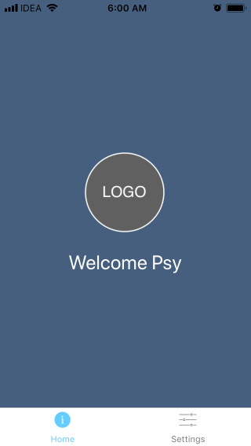
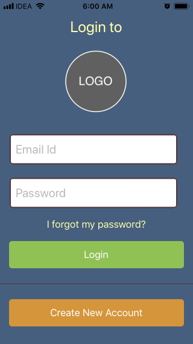
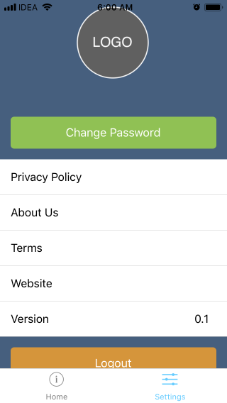

# expo firebase boilerplate 

**expo firebase boilerplate** is your way to quick start your projects which use firebase and Expo(react-native). 
Project includes Signup , Login functionality , settings, change password and forgot password. 
This project can also be used if you plan to eject expo. 

### Table of Contents
1. Features
1. Getting Started
1. Application Structure
1. Linting
1. Testing
1. FAQ

## Features

- Firebase
- [React(16.3)](https://5b05c94e0733d530fd1fafe0--reactjs.netlify.com/ "React(16.3)")
- [React Native(0.55)](https://facebook.github.io/react-native/docs/0.55/getting-started.html "React Native(0.55)")
- [expo(30.0)](https://docs.expo.io/versions/v30.0.0/ "expo(30.0)")
- [expo vector icons](https://expo.github.io/vector-icons/ "expo vector icons")
- [native-base(2)](https://docs.nativebase.io/ "native-base(2)")
- [react-navigation(2.16)](https://reactnavigation.org/docs/en/getting-started.html "react-navigation(2.16)")
- [recompose](https://github.com/acdlite/recompose "recompose")
- [react-redux-firebase(2.1)](http://react-redux-firebase.com/docs/api/props-firebase.html "react-redux-firebase(2.1)")

## Getting Started
After cloning this project.
Copy [config.sample.js](config.sample.js "config.sample.js") as config.js and edit the config.js as per your firebase config.

`npm install expo-cli --global` (or `yarn global add expo-cli` , whichever you prefer) to  install expo globally. 
`npm install`(or `yarn`)  install dependencies 
`expo start`  to start the project

*Note: latest version of expo has dropped exp command in favor of expo. *

## Application Structure

1. expo firebase boilerplate comes with default application structure when you do `expo init`
1. We added components directory where you can add any shared components. We even added an alias to this directory as  `@components` which can be used for imports.
1. Styles that are shared can be added in [components/GlobalStyles.js](components/GlobalStyles.js "components/GlobalStyles.js") and reused accross your components. To import simply use 
`import { GlobalStyles } from '@components'`
1. 
	1. To aid preloading of images we have added a module called images.
	1. Add image like   `logo: require('../assets/images/icon.png')`  in [components/images.js](components/images.js "components/images.js")
	1. Use your imported image like below 
	`<Image source={images['logo']} ></Image>`
1. 
	1.  We use recompose a lot and prefer writing recompose higher-order components on top of our dumb components
	1. Most of the components are broken into folders and each folder has an enhancer.js which is a higher-order components, index.js which holds the template and binding of smart and dumb components and an optional style.js 
	1. Refer [https://github.com/acdlite/recompose/blob/master/docs/API.md](recompose "https://github.com/acdlite/recompose/blob/master/docs/API.md")

## Linting 
Expo projects by default do not include linting, this project supports linting, also supports git hook before commit. 
You can lint your projects `npm run lint:fix` before commiting your code.

## Testing
Todo

##FAQ
Can I use this with firestore.
Sure you can, refer [react-redux-firebase](http://react-redux-firebase.com/docs/firestore.html "react-redux-firebase")  and make changes to [store/index.js](store/index.js "store/index.js")

Project is still in the early stages. Please file an issue or submit a PR if you have suggestions! 

I plan to make non firebase versions as well and keep this project updated for every new upcoming expo versions

License
MIT 	

### Author:

Sethuraman Subramanian

Bhavika Thakkar

Want to hire me, contact me at megastarxs@gmail.com
